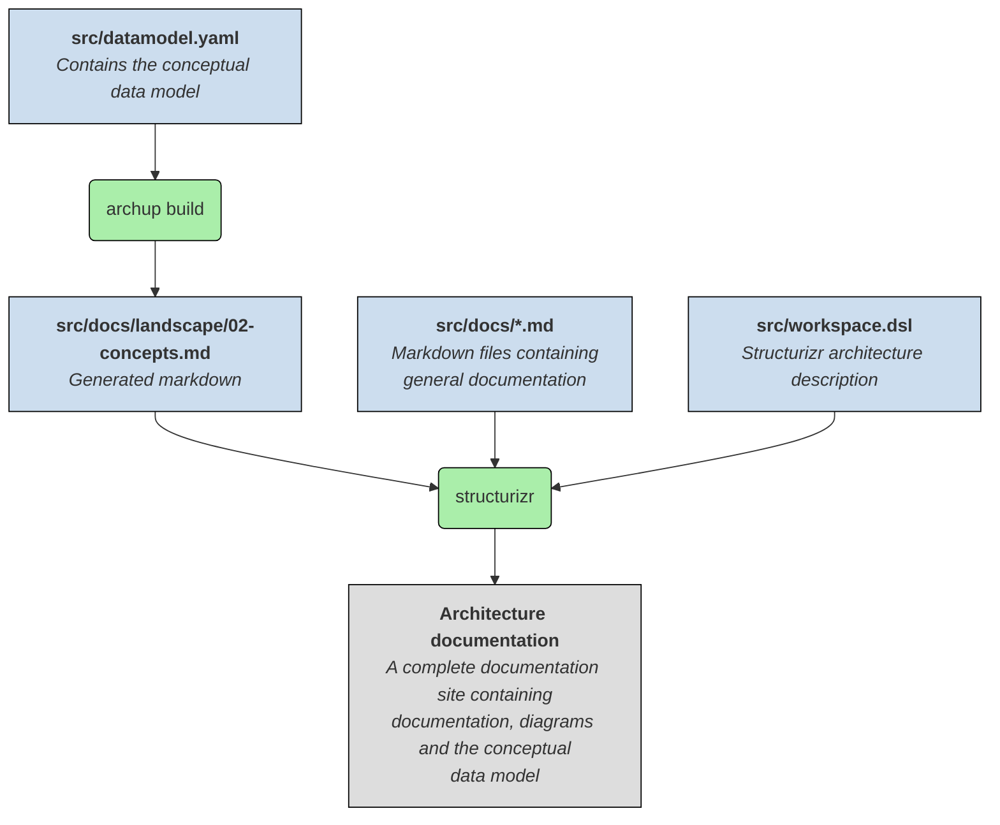

# Archup

## Getting started

Install `archup`:

```
pip3 install git+https://github.com/anorm/archup
```

Create a new project:

```
archup project new foo
```

Enter the project directory

```
cd foo
```

Build and run:

```
archup build
docker compose up
```

Navigate to http://127.0.0.1:8081


## Shell completion

### Bash

Add this to `~/.bashrc`:

```
eval "$(_ARCHUP_COMPLETE=bash_source archup)"
```

### Zsh

Add this to `~/.zshrc`:

```
eval "$(_ARCHUP_COMPLETE=zsh_source archup)"
```

## How it works


